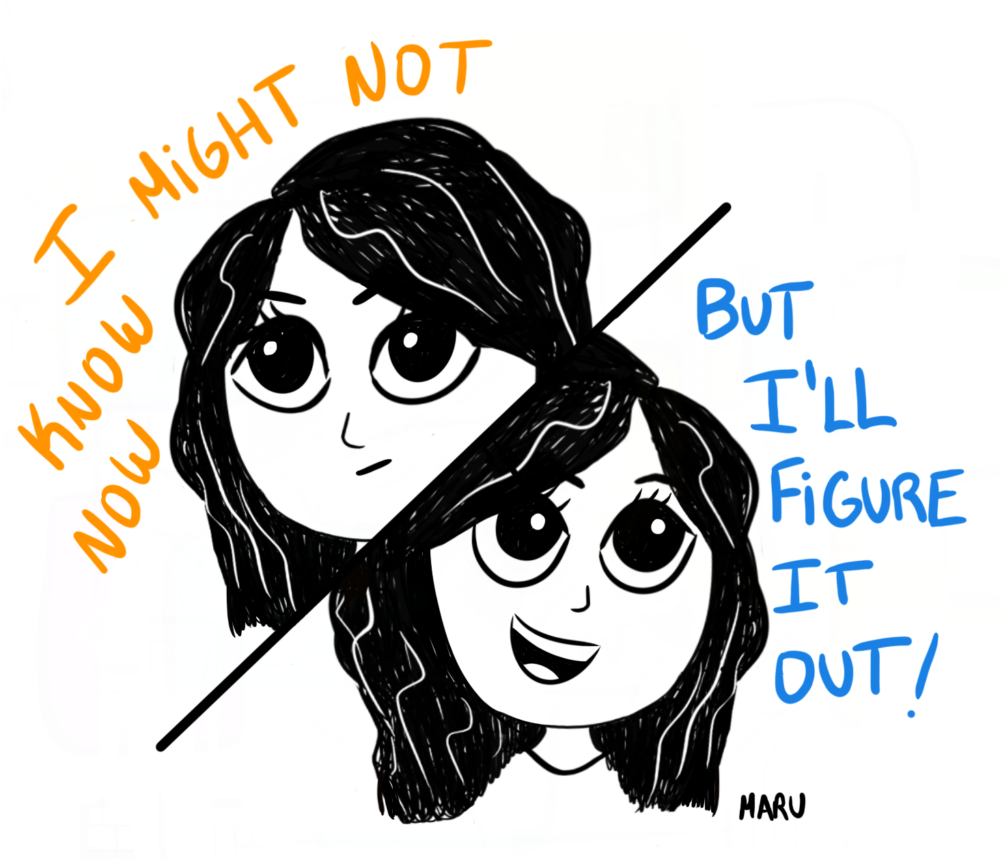
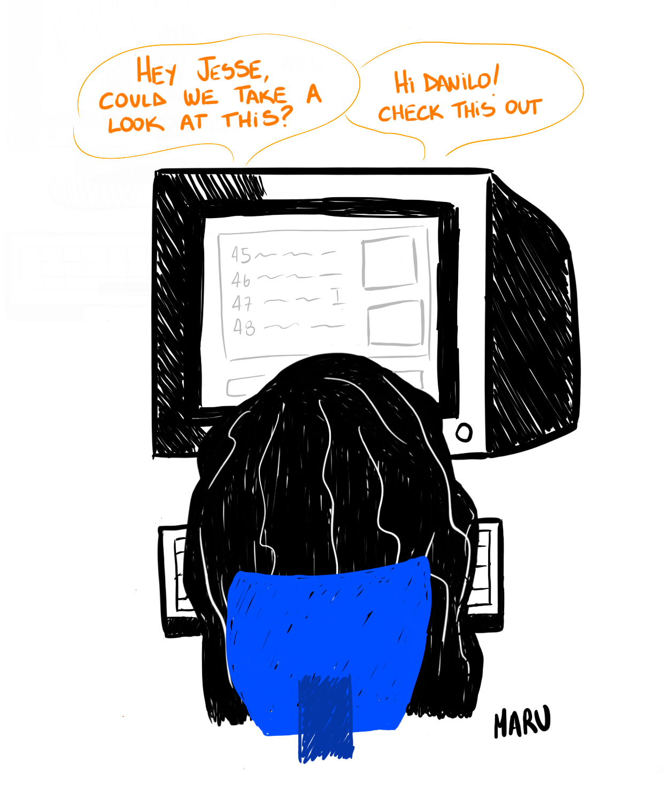

Back in December 2021 I wrote "4 months working as a developer" which is a blog I'm very proud of, as it has some good personal reminders. Now I'd like to make an update on my experience because to this date I've been working as a front-end developer for 17 months (time flies, I know) and oh boy, I've learned so much during this time.

## Gaining confidence

I won't lie, when I first started working as a developer I was very overwhelmed with all the new information I was receiving and most importantly, all the new responsibilities. I had to fulfill a role in which I had no previous professional experience. Even though I had worked so hard to prepare myself, studied and coded for many many hours, I was still very insecure of my skills (which is completely normal being a junior).

I tried to constantly remind myself that I needed to give me some time and be patient while I adjusted to the whole new experience, but of course, it wasn't as easy as it sounds and I would get very frustrated sometimes. But guess what? Giving it time worked! I did eventually start to feel a bit more confident and less anxious.

I realized that "being confident" wasn't just about having the "perfect" skills, there’s so much more in being a developer than just having great technical skills. Having a good understanding of the codebase, business logic and tools used in the company play a huge part. Understanding the product development process, having a good communication with your teammates and being organized with your daily tasks is just as important as your coding skills.

So focusing on understanding all of these things helped me feel more confident on those days where my coding skills were making me feel like an imposter.

I know I still have a long way to go and there are so many things I want/have to learn to improve my skills, and even though I still get anxious sometimes there’s one thing I'm 100% confident about and it's that I might not know how to do something right now, but you can bet I'll do my best to figure it out!

## So much decision making

I've realized that a very significant portion of my time while coding goes into making decisions.

From the very first moment you start coding you have to start making decisions: which syntax to use, which approach to follow, how to name your variables and functions, which CSS properties to use, "to abstract or not abstract?", and so much more… But now that I've been doing this for more than a year, working in a real life application with a team, I can see/appreciate better the impact these decisions can have, so I’ve learned to not underestimate them.

Now I feel like I have a broader understanding of the questions I should be asking myself and the things I should be considering when coding something and deciding which approach to take. For example, I've learned that it's important to consider how my changes will impact the readability of the codebase, as well as the performance, accessibility and user experience of the app.

And there are also the more organizational type of decisions we have to make, like deciding how to manage our time, prioritizing daily tasks and other stuff like identifying when you're spending too much time on something that's not an actual issue or bug (lol).

I've also learned that these aren't decisions I always have to make alone and collaborating with teammates is extremely beneficial to get ideas and come up with a solution together, and it's also way more fun! (more on this later)

## Following patterns

As I started working on a codebase I was seeing for the first time and in a framework I didn’t have a lot of experience (which was Laravel), I would always try to look for existing patterns in the code to get some ideas or to know which syntax and functions to use.

This approach worked fine for smaller issues but as I started working on bigger fixes and features I realized (and my teammates helped me realize) that there was a big problem with this method, which is that a very significant portion of the app was legacy code and we had code that was (sort of) working but it wasn't written in the best way possible, for example, it was working but it could potentially represent a security issue, or it wasn't performant. So, without realizing, I was learning some bad principles.

Now I've learned that when possible, it's a healthy practice to question why something is written the way it is (especially when talking about legacy code) and look for areas of improvement instead of just following current patterns.

I should also mention that what’s been helpful to know when and how to question something is that I've dove deep into the Laravel docs, taken a few Laracasts courses and most importantly, I've had the help of my senior devs.

## Code collab

One of the biggest highlights of the past 6 months is that I started having recurring code collab sessions with my senior devs and I can't explain how helpful it's been, especially being a completely remote team!

Being able to talk through problems, think about possible solutions, and make decisions together is really nice and has helped me gain more confidence as well. It feels like a safe space to try new things, to learn and ask questions without feeling judged.

## Some other things I've learned

- Never trust user input, only store validated data.
- A bug is a missing test AND writing tests can really make you question your skills.
- Dealing with iframes is very annoying.
- Accessibility shouldn't be a nice to have.
- Working on a big feature and then seeing it live is extremely satisfying!
