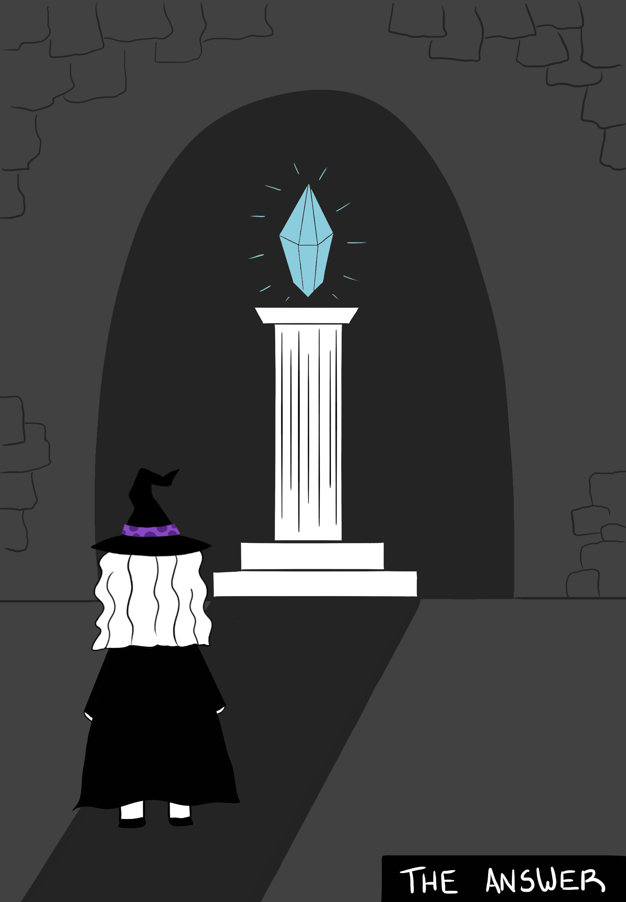

Somehow it's been 3 years since I started working as a developer. The last time I wrote one of these updates was over a year ago and even though I always find myself saying I've learned a lot, this time feels different. I've grown a lot not just as a developer, but as a person as well. That makes this even more exciting, so here are some of the lessons I've learned since my last update!

## Taking the 5 minutes

In one of my previous journal entries I mentioned that I used to think knowledge gaps were simply the things you don't know, but I've realized they also include the things you think you know, but aren't entirely correct.

Turns out these misconceptions are not as easy to identify, unless something goes wrong. When you've been coding for some time and you've become familiar enough with a programming language, of course you rely on your trusted set of functions and preferred syntax that hasn't failed you… Until it does, because you ran into an edge case and realized the thing you thought worked in a certain way had some intricacies you didn't fully understand.

I've learned that testing your knowledge of even the basic concepts is a good habit to have. Taking a moment of your day to understand how something works and revisiting it any time you feel like you have doubts is time well spent and your future self will thank you for it.

I haven't learned this on my own, my friend Jesse, a ~~real coding wizard~~ senior developer, has taught me the importance of really understanding how your code works by reading docs, testing edge cases and sometimes going to the source code of the tool you're using.


I think taking the time to understand how the tool you're using works is especially important with frameworks. When you're using a framework that has a lot of "magical" helpers, it's nice because it hides a lot of the complexity but you might run into some unwanted behavior if you don't understand the implications of using certain features. The other reason why I think it's good to look into how they work is because it will help you gain deeper knowledge not only of the framework but also of the language it uses.

A small example is that the other day during a code review I learned that Laravel was magically protecting me when using the nullsafe operator for something like this:

```php
$order->invoice?->number;
```

Even if `invoice` is undefined, the previous code won't cause a fatal error because Laravel models use `__get()` to return `null` when accessing undefined properties, making `?->` work as expected. On the other hand, regular PHP classes don't handle undefined properties by default, which would led to an error in the previous example because the nullsafe operator only works on null values.

I've found that learning even small things like this makes a big difference and also improves your confidence when writing code.

## The perfect answer

Whenever it's taking me some time to think of an answer to something, I start feeling anxious. Especially now that I've been doing this for 3 years, sometimes there's this little voice in my head that starts saying "shouldn't you know this by now?", even if it's a very complex question, which makes it very unfair. I'm learning to not give that voice too much power because in reality I'm more the type of person to think that even if I don't know how to do something, I'll always do my best to figure out.

Even though there are some very straight forward questions you should have the answer to like _"Should you deploy to production before running tests?"_, I'm learning that in coding, not everything is about having the perfect answer right away, but it's more about your critical thinking and how you approach working on a task.

I think the steps you take to tackle a task are just as important as the final answer because the better you become at breaking down problems, the faster you will be able to solve them.



I've considered myself a "slow thinker" in many situations because depending on the subject it can take me time to interpret information. I used to think this was a bad thing, but I've realized that thoughtful problem-solving has its advantages. If you've ever felt the same way, you might feel identified: it usually means you take the time to investigate issues thoroughly, read as much as possible to prepare, and avoid jumping to conclusions too quickly.

Of course, how much time you take to investigate depends on the urgency of the task, but the best part is that as you gain more experience, improve your critical thinking and learn from your mistakes, you **do** become more efficient at figuring things out. I mean, Maru from 3 years ago would be extremely proud of everything she's learned since then!

Seeing how other experienced developers work has been **very** important to improve my mental model for solving problems. Collaborating with your teammates helps a lot, as well as reading from others' experiences, for example, Julia Evans' zine called [The Pocket Guide to Debugging](https://wizardzines.com/zines/debugging-guide/) is an amazing and fun way to learn specific debugging strategies.

## Staying up to date

When I used to be active on Twitter I remember one of the most common debates in the tech community was about how much time you should spend learning about new technologies. It felt like there were two opposites, one side advocating for staying up to date with the newest stuff, trying out every shiny new thing and another side that said it wasn't necessary because you just need to know enough to do your job.

Social media can make you feel like you have to pick one side instead of forming your own opinion and I remember seeing that discussion and feeling anxious because I didn't know which side was right, but it just meant I needed more time and context to figure out where I stood.

When it comes to how much time you should spend learning new things, I've realized there has to be a balance (shocking, I know!). It's important to keep learning while also avoiding getting overwhelmed by too much information, especially nowadays, when everything seems to be constantly changing.

It's true that you mainly need to know enough to be able to do your job, but that doesn't mean you have to stop growing as a developer or that you can't try different things every now and then. Besides, no job is completely secure, so making sure your skills and knowledge are in a good place is really important.

That also doesn't mean you have to try out every single new technology, I've realized picking a few areas that interest you is more manageable and as you gain more experience you can explore even more.


## When your ideas exceed your abilities

One of my favorite recent reads has been Tomorrow, and Tomorrow, and Tomorrow by Gabrielle Zevin. It's a book about the lives of two game developers, Sam and Sadie. At the start of their careers, when they decided to make their first game they didn't realize how much work it was going to be, they had a lot of amazing ideas but Sadie (the main developer) didn't have the skills to make it as grand as they wanted. This frustrated her but she kept working on the game nevertheless.

During this part of the story there's a quote that really resonated with me:

> There is a time for any fledgling artists when one's tastes exceeds one's abilities. The only way to get through this period is to make things anyway.

I understand Sadie's frustration because I've also experienced it. These last 3 years working as a dev have taught me that sometimes you just have to start, no matter how imperfect your skills may be. First versions are rarely great but you learn so much from them and eventually you're able to build your idea exactly how you envisioned it.

This is the mindset I'm trying to hold onto whenever I struggle with a project or a task.

The only way to improve is to keep going and _make things anyway_.


