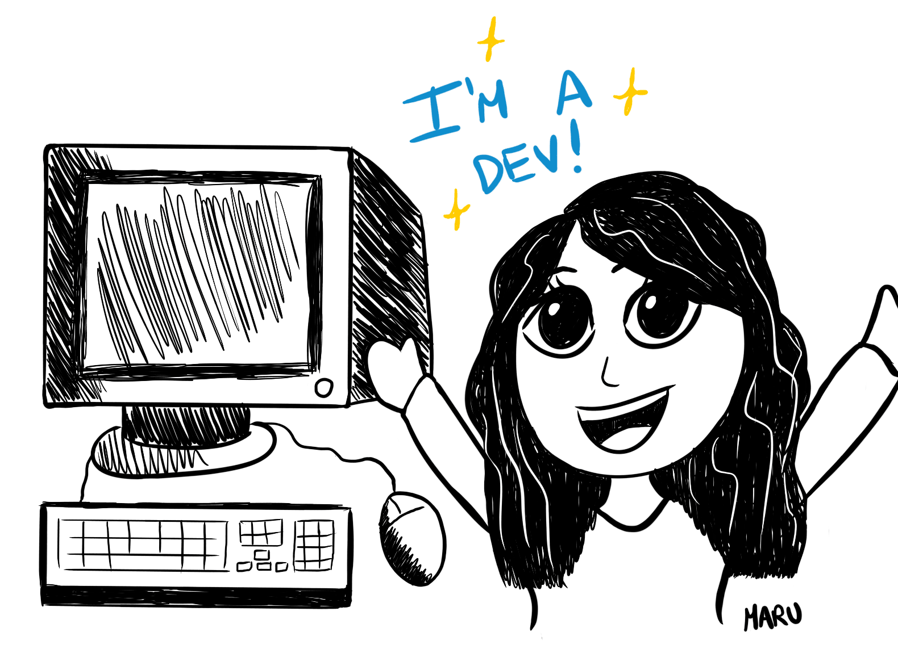
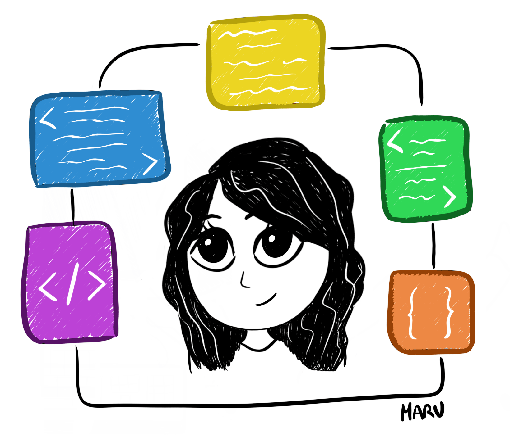
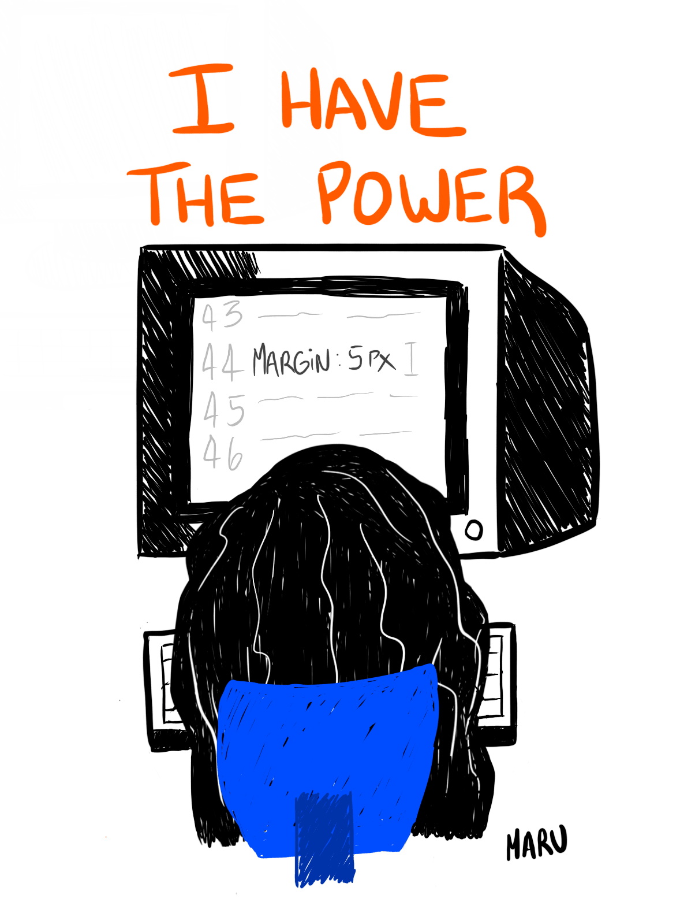

Last year when I decided to study web development on my own I had no idea how much of my life would change and I'm incredibly grateful to say that it's been one of the best decisions I've made.

4 months ago I landed my first job as a front-end developer so I thought this would be the perfect opportunity to share a little bit of my experience, the things I've learned while being part of an engineering team and hopefully help others that are going through a similar process.

## Making assumptions & asking questions

I noticed that every time I've felt anxious while working, it was because I started making assumptions instead of just asking questions. Being the "new one" in a team will always feel overwhelming, (especially if you're a junior), and getting comfortable asking questions is one of the things I struggled with the most during my first weeks, therefore, I ended up assuming a lot of things.

I'm definitely still working on this but now that I've recognized the issue is a lot easier to try to avoid it.

> If you're always assuming you know how others think and feel, you stop listening and communicating.

The previous quote summarizes why I believe assumptions are a big problem. They prevent you from communicating effectively, and when you're new at a job, that means they prevent you from building relationships and trust with your team members. You also miss the opportunity to learn from them.

Maybe you start working on the wrong thing because you were too afraid to ask for clarification, or maybe your co-worker would have helped you understand the problem better.

It will always be easier to make assumptions because then you don't have to ask anything that might make you seem "dumb", but then the uncertainty can lead to anxiety. The more comfortable you feel asking questions, the better your experience in the team will be.

Like I mentioned before, recognizing that I do this has helped me to avoid it as much as I can, and these are some of the questions I try to ask myself to identify whether or not I'm assuming something:

- "Are the instructions for this task clear enough?", "Do they specifically state the definition of done?"
- "Do I understand the problem I'm trying to solve or the feature that needs to be implemented?"
- "Do I have all the resources I need to complete this task?"

If you have a doubt that's stopping you from working properly and after going through the instructions again or doing some research, you're still not 100% sure and you need more context, then it's time to ask a question.

## Working on the "easy" tasks

When you're just getting started, you most likely will be given the "easy" tasks so they can get to know you and how you work, which is your opportunity to demonstrate your skills and also your work ethic.

In my opinion, even the smallest tasks should be done thoughtfully, because those are the ones that are often underestimated and can lead to a lot of bugs and weird behaviors if done badly.

Take that opportunity to get familiar with the codebase, understand how things work together, and take notes of the solutions you implement so you can apply them again in the future. The "easy" tasks will help you feel more comfortable to then tackle bigger issues.

The whole experience of being able to put my skills into practice on a real-life project that’s being used by so many people has been surreal, just doing some tiny changes like adjusting the margin of an element makes me feel like I have superpowers.

## Plan your work & organize your time

One thing I've realized is that organizing your workdays helps relieve and prevent anxiety. If you have a clear idea of what you're going to be working on for the week, then you're most likely to be productive and feel more relaxed.

You can use any time management system that works for you. In my case, writing weekly to-do lists works perfectly, as they allow me to visualize the whole week and make sure I don't miss anything.

If you're feeling uncertain, then it's time for some more questions!

- Ask about your team's plans and goals.
- Ask what's expected of you, make sure you understand your responsibilities, and that you make time each day/week for them.

## Be nice (and patient) with yourself

You don't have to finish or accomplish something each day, we all want to deliver results and do it fast to prove that we're capable. We want to end the day with a win but it won't always be the case, and that's totally normal.

I'm trying to be better at taking breaks too, they're the ultimate productivity hack. Any time you feel stuck, please, take a break! Spending hours obsessively trying to fix a bug when you're already feeling tired will only do more harm than good.

Lastly, I want to remind myself and anyone reading this, to be patient while you adjust to new experiences. The most experienced dev was once a junior too and this also applies to any field so don't feel discouraged if some things take you longer than others.

Don't forget to take care of yourself and enjoy the process.

