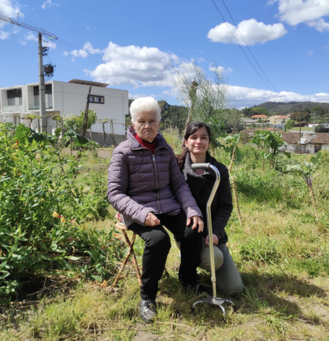
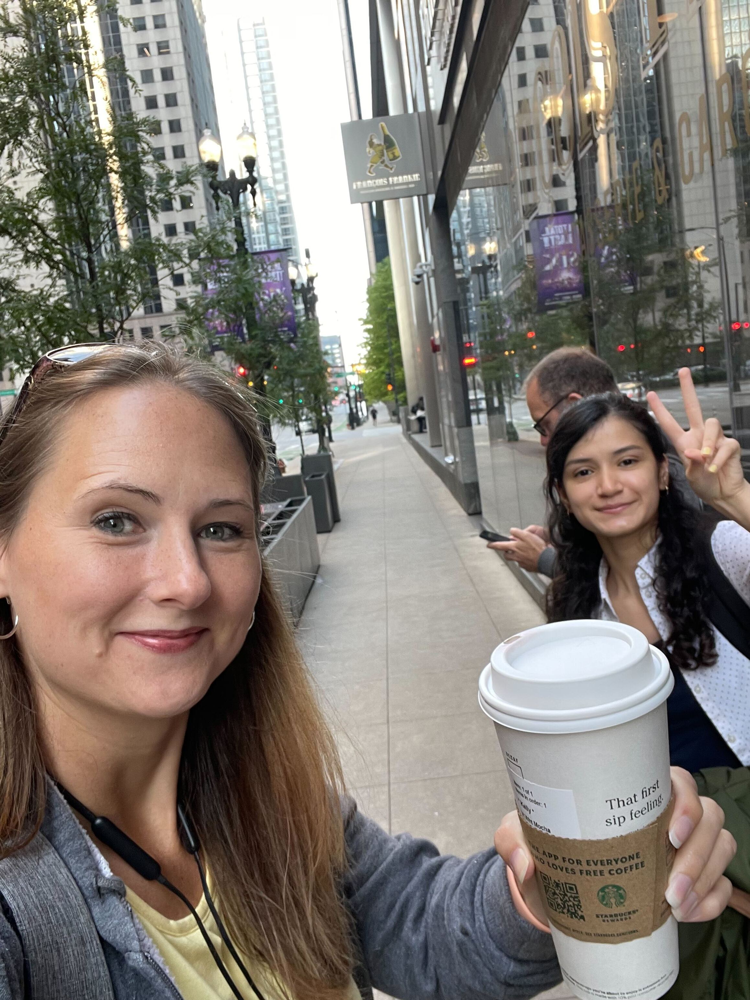

A lot of things have happened in the last 5 months. Here’s a life update!

## Side projects

Ever since I started my first developer role I’ve been having a hard time trying to balance work and the side projects I want to build. Well, if I’m being honest, I should say “the side projects I feel like I have to build”. While learning how to code, I developed a strong habit of practicing every day and building stuff, and to this day, I still feel the pressure to continue doing it at the same pace. Like spending most of my day coding at work it’s not enough, right?

I believe most developers experience a similar pressure as well, which is not great. In my case (regardless of how cheesy it sounds), I’ve learned that side projects should be something you enjoy to some extent, or at least something you’re excited to build, otherwise, it’s difficult to find the time for them.

So, during this time I’ve been learning to listen to my body and focus on the things I really want to build & learn outside of work at a better pace, without forcing myself.

I managed to complete two fun projects!

### Airbnb Clone

I wanted to build another project with [Sanity.js](https://www.sanity.io/) so this Airbnb clone uses Sanity to handle the content and [Next.js](https://nextjs.org/) on the front-end. I used this project to try two other libraries that looked really interesting: [Leaflet.js](https://leafletjs.com/) (for the map) and [HeadlessUI](https://headlessui.dev/) (for the quick view modals).

I implemented a likes feature as well, using API routes and serverless functions. It doesn’t work great for now, but it was fun to implement!

[🔗 Live site](https://airbnbclone-maru.vercel.app/)

## Ticket to Calculate

Ticket to Ride is currently my favorite board game (thanks to my friend Juan for introducing me to it), however, the scoring process can be very tedious, so I created this calculator to help with that. You can add several players, add points for each one and end the game to filter the players by ascending score. For now, it only has the destination cards from the Europe version.

It’s built with Next.js and Tailwind.

[🔗 Live site](https://tickettocalculate.com)

## Study

I’ve been focused on improving my React skills, especially, studying to improve the way I handle the state of my applications. The new [React beta docs](https://beta.reactjs.org/) have been a HUGE help for that, I’ve going through the documentation and interactive exercises regularly.

I’ve also been going through Josh W Comeau’s [CSS for JavaScript developers](https://css-for-js.dev/) course. It’s amazing and can’t recommend it enough.

## Work

In August 2022, it will mark one year after I landed my first job as a front-end developer at Castos! The past 6 months have been great and I’ve been learning like crazy. I’ve also worked on some super cool projects that I’m really proud of.

## Personal updates ✨

While handling work & study, I was also in the middle of a big move! My second time moving to another country, this time to meet my family in Portugal (my new home).

Last but not least, I also traveled to Chicago for the company retreat, and was able to finally meet my co-workers. This was my first time in the US and I had such a great time!

