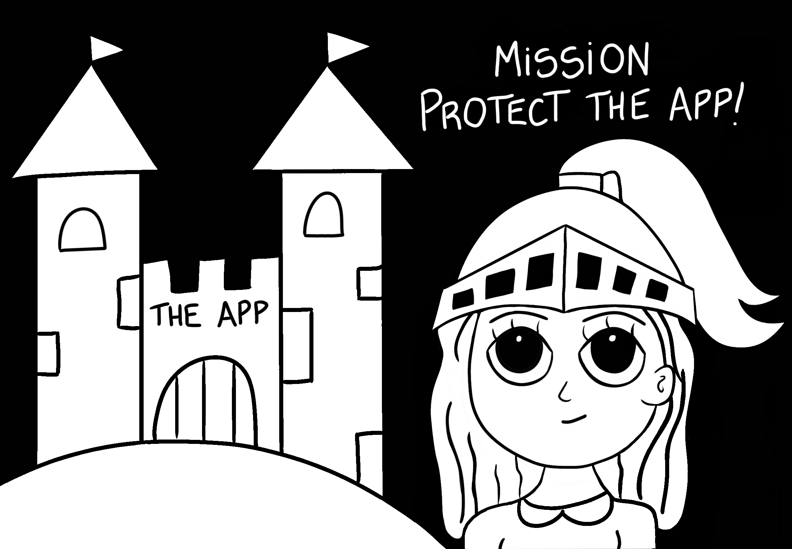

This year I discovered zines are a great studying resource thanks to [Julia Evans](https://twitter.com/b0rk). Her [Wizard Zines](https://wizardzines.com/), are just awesome and they inspired me to make one of my own.

I made a zine about XSS attacks and HTML escaping, it's based on my personal story and it’s a compilation of all the explanations that have helped me understand these two topics (with some fun drawings!).

As mentioned in the zine's introduction, it is not a deep dive into the topic but rather an overview of the main concepts necessary to prevent XSS attacks, I would say it’s a good introduction.

I hope reading it brings awareness to one of the most common web security vulnerabilities, making this zine certainly did it for me :)

[Read it here ⚔️](/cross-site-scripting-zine.pdf)

