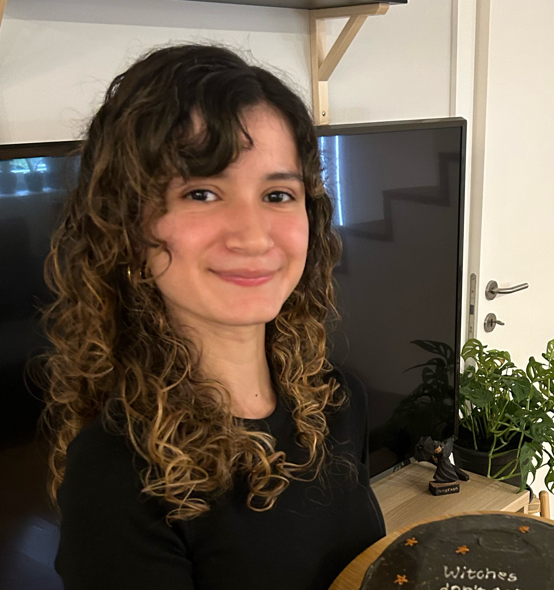

I'm a **self-taught frontend developer** who loves bringing ideas to life in the form of beautiful, accessible and user-friendly web apps. I'm currently working as a full-time developer at [Castos](https://castos.com/), a podcast hosting platform.

I like to write about my experience working as a dev, about what I'm learning and occasional personal stuff.

This is my [GitHub](https://github.com/marugy99). I used to be active on [Twitter](https://twitter.com/marugy99) but not anymore!

## Skills

JavaScript, React, Laravel, PHP, CSS, HTML, Git.

## About me

- 🇵🇹 Currently based in Portugal.
- 🇻🇪 From Venezuela.
- ✨ I love books, horror movies, board games and memes.
- 📹 In 2021 I made a series of videos called ["Getting into Web Development but make it The Office"](https://www.youtube.com/watch?v=YIRhBsOrVLw&list=PL-BItZRUAAOWXT3ybv7NO-Ifci61ZLTYp) that I'm honestly very proud of lol.

